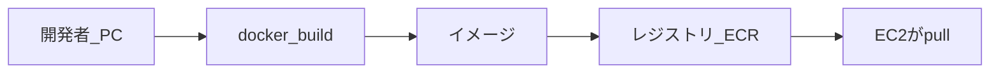
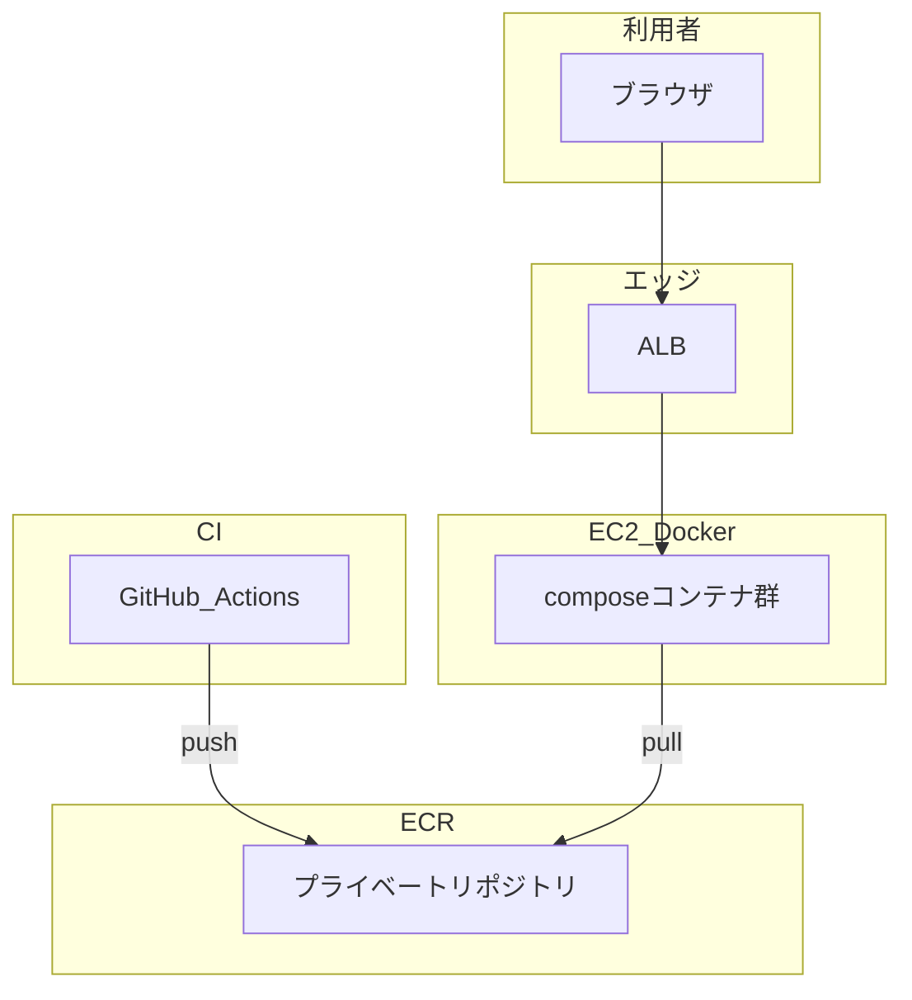
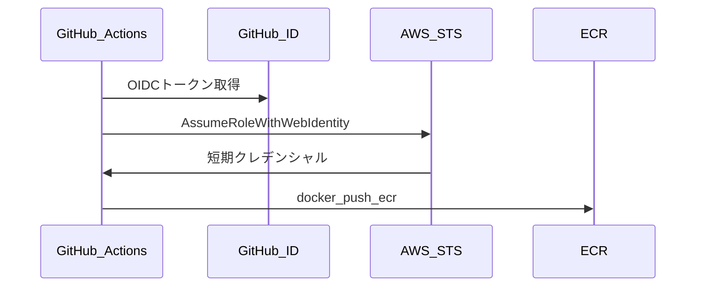
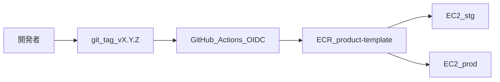
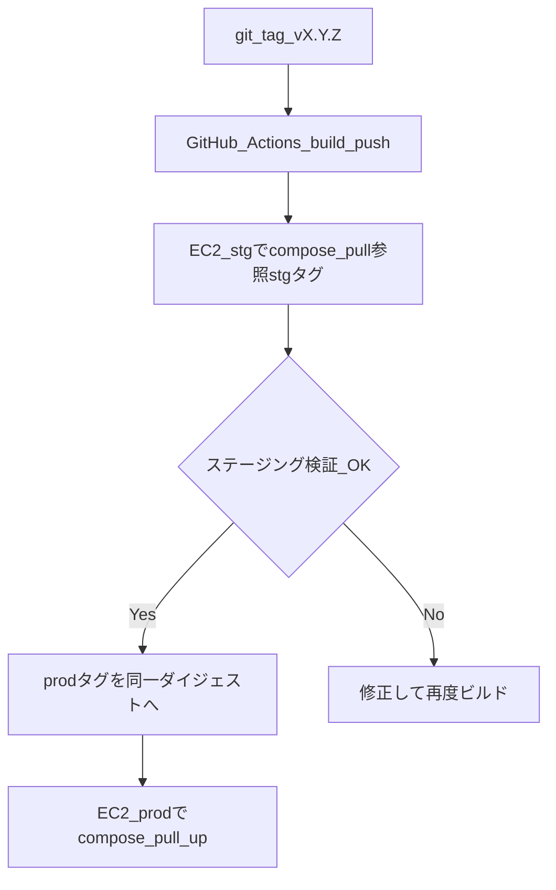

# Amazon ECR 構築・運用ガイド（本テンプレート / EC2 + Docker 前提）

このドキュメントでは、**Amazon Elastic Container Registry（ECR）** を **単一 AWS アカウント内の stg / prod** 向けに構築し、**GitHub Actions（OIDC）からイメージを push**、**EC2 上の Docker が pull** できる状態までの手順を説明します。

> **想定読者**: ソフトウェアエンジニアとして開発経験はあるが、AWS のインフラ経験は浅い／急遽インフラ担当になった方。各章で **用語メモ** と **なぜその設定が必要か** を補足しています。

> **本書の到達点**: `product-template/backend` と `product-template/frontend` の 2 リポジトリを東京リージョンに用意し、Semver タグと `stg` / `prod` 等の可変タグで運用できること。CI は **長期アクセスキーを使わず** GitHub OIDC で AWS に接続します。

## 目次

1. [はじめに](#1-はじめに)
2. [前段知識（重要）](#2-前段知識重要)
3. [アーキテクチャと設計方針](#3-アーキテクチャと設計方針)
4. [作業前の準備](#4-作業前の準備)
5. [AWS コンソールでのリポジトリ作成](#5-aws-コンソールでのリポジトリ作成)
6. [ライフサイクルポリシー設定](#6-ライフサイクルポリシー設定)
7. [リポジトリポリシー設定](#7-リポジトリポリシー設定)
8. [GitHub Actions OIDC 連携（CLI 手順）](#8-github-actions-oidc-連携cli-手順)
9. [初回の動作確認（手動 push）](#9-初回の動作確認手動-push)
10. [EC2 との連携](#10-ec2-との連携)
11. [日常運用フロー](#11-日常運用フロー)
12. [レプリケーション（将来拡張・参考）](#12-レプリケーション将来拡張参考)
13. [コストの考え方](#13-コストの考え方)
14. [トラブルシューティング](#14-トラブルシューティング)
15. [付録: 用語集](#15-付録-用語集)
16. [関連ドキュメント](#16-関連ドキュメント)

---

## 1. はじめに

### 1.1 このマニュアルの読み方

| 読み順 | 内容 |
|--------|------|
| **GUI（コンソール）** | ECR リポジトリ作成・ライフサイクル・スキャンなど、画面操作が向いている部分 |
| **CLI** | IAM OIDC プロバイダ登録、信頼ポリシー付き IAM ロール作成など、コピペで再現したい部分 |
| **コラム** | 用語メモ・つまずきポイント・設計の理由 |

公式ドキュメントへのリンクは本文中および章末に記載しています。不明点はまず該当サービスの公式ガイドを参照してください。

### 1.2 本テンプレートにおける ECR の位置づけ

本プロダクトは **単一 EC2 上で Docker（docker compose）** を動かす前提です（概要は [docs/ops/aws-infrastructure-best-practices.md](ops/aws-infrastructure-best-practices.md)）。アプリケーションの Docker イメージを保管し、`docker compose pull` で取得する場所が **ECR** です。

CI/CD と IaC の方針は [ADR-0026: CI/CD 方針（GitHub Actions / ECR、IaC は見送り）](adr/0026-cicd-without-iac.md) を参照してください。

---

## 2. 前段知識（重要）

> **この章のゴール**: 以降の手順で登場する「コンテナ」「レジストリ」「IAM」「OIDC」「タグとダイジェスト」の関係をつかむこと。

### 2.1 コンテナと Docker イメージの超基本

**用語メモ — Docker イメージ**: アプリケーション・ランタイム・設定などをまとめた「読み取り専用のレイヤーの束」。コンテナはそのイメージから起動したプロセス環境です。

典型的な流れは次のとおりです。



1. **build**: `Dockerfile` からイメージをビルドする。
2. **push**: イメージをレジストリにアップロードする。
3. **pull**: 実行環境（EC2 上の Docker）がレジストリからイメージをダウンロードしてコンテナを起動する。

### 2.2 コンテナレジストリとは / ECR は何者か

**用語メモ — コンテナレジストリ**: Docker イメージを保存・配布するためのサービス。公開の **Docker Hub** と並んで、AWS が提供するプライベートレジストリが **Amazon ECR** です。

| 比較 | Docker Hub（例） | Amazon ECR |
|------|-------------------|------------|
| 主な用途 | 公開イメージ／開発者向け | **同一 AWS アカウント／組織内** のプライベート配布 |
| 認証 | Docker Hub アカウント等 | **IAM**（誰が push/pull できるかを制御） |
| リージョン | グローバル概念に近い | **リージョン単位**（東京なら `ap-northeast-1`） |

参考: [What is Amazon ECR?](https://docs.aws.amazon.com/AmazonECR/latest/userguide/what-is-ecr.html)

### 2.3 本テンプレートの全体像（ざっくり）



- **ECR** は「コンテナの置き場」。**EC2 + Docker** は「そのイメージを pull して `docker compose` で起動する実行環境」です。
- ユーザー向け HTTP は **ALB** 経由でタスクに届きます（詳細はネットワーク ADR 等）。

### 2.4 AWS の登場人物（クイック解説）

| 用語 | 一言で |
|------|--------|
| **リージョン** | 東京・大阪などデータセンターのまとまり。ECR の URI に含まれます。 |
| **VPC** | 仮想ネットワーク。EC2 や RDS はここに配置されます。 |
| **IAM ユーザー** | 人間やプログラムが使う「長期クレデンシャル（アクセスキー）」と紐づくことが多い主体。**本マニュアルでは CI にアクセスキーを使わない方針**です。 |
| **IAM ロール** | 「AWS 内のサービスや外部 IdP が **一時的に引き受ける**」ための身份。**EC2 インスタンスプロファイル**や **GitHub Actions（OIDC）** はロールを使います。 |
| **ポリシー** | ロールやユーザーに「何が許可されるか」を JSON で定義したもの。 |
| **インスタンスプロファイル** | EC2 にアタッチする IAM ロール。アプリから Secrets / SES / ECR API を呼ぶために使う。 |
| **docker compose** | 複数コンテナをまとめて起動するツール。本テンプレートは backend + frontend の 2 サービス。 |

### 2.5 IAM の基礎（最小限）

**用語メモ — 最小権限の原則**: 必要な API だけを許可する。ECR への push は CI ロール、pull は **EC2 インスタンスプロファイル**（または手動 `docker login` 用の一時クレデンシャル）に分けるイメージです。

- **信頼ポリシー（Trust policy）**: 「誰がこのロールを引き受けられるか」（例: GitHub の OIDC トークンを持つ主体）。
- **許可ポリシー（Permissions policy）**: 「そのロールが何をできるか」（例: `ecr:PutImage`）。

### 2.6 OIDC 連携とは何か（GitHub → AWS）

**用語メモ — OIDC（OpenID Connect）**: ID トークンを発行し、**第三者が本人性を検証**できる仕組み。GitHub Actions はジョブ実行時に OIDC トークンを発行できます。

**なぜアクセスキーを使わないのか**: 長期アクセスキーは漏洩リスクが高い。**OIDC** を使うと、GitHub が「このジョブはこのリポジトリのこの ref から来た」と証明し、AWS はそれを **IAM ロールの信頼ポリシー**で検証したうえで短期クレデンシャルを発行します。

ざっくり流れ:



参考: [GitHub Docs: Configuring OpenID Connect in Amazon Web Services](https://docs.github.com/en/actions/deployment/security-hardening-your-deployments/configuring-openid-connect-in-amazon-web-services)

### 2.7 イメージのタグとダイジェスト

**用語メモ — イメージタグ**: 人間が読むラベル（例: `v1.2.3`、`stg`、`prod`）。**同じタグ名を後から別イメージに付け直す**ことができます（可変タグ）。

**用語メモ — ダイジェスト**: `sha256:abcdef...` の形式で、**ビルド結果のコンテンツを一意に指す**不変の ID。stg で検証した **同一バイナリ** を prod に上げるときは、**ダイジェストが同じ**ことを確認すると安全です。

本マニュアルの運用では:

- **Semver**（例: `v1.2.3`）: リリース単位の「名前」。基本は上書きしない運用を推奨。
- **`stg` / `prod` / `latest`**: **検証済みのビルドを指すポインタ**。昇格時に「同じダイジェストにタグを付け替える」考え方が使えます。

> **つまずきポイント**: 「prod タグを付け替えたら本番も変わる」は **意図した動作**です。誤って別ビルドを指さないよう、**ダイジェストを確認する習慣**をつけてください。

---

## 3. アーキテクチャと設計方針

> **この章のゴール**: 以降の設定値の意味を一文で説明できるようにすること。

### 3.1 データフロー（Mermaid）



### 3.2 設計方針一覧（本プロダクト向け）

| 項目 | 方針 |
|------|------|
| リポジトリ分割 | サービス単位: `product-template/backend` と `product-template/frontend` |
| アカウント / 環境 | **単一 AWS アカウント**内で **stg / prod のみ** を対象（dev 用 ECR は本書では作成しない想定） |
| リージョン | `ap-northeast-1`（東京）単独 |
| 記述スタイル | **コンソール手順を主**、IAM/OIDC は **CLI** で再現可能に |
| Push 認証 | **GitHub Actions OIDC のみ**（長期アクセスキーは使わない） |
| タグ戦略 | **Semver `vX.Y.Z`** + 可変ポインタ **`latest` / `stg` / `prod`** |
| タグ不変性（immutable tags） | **無効** — 可変タグを運用するため（Semver は運用上「上書きしない」） |
| 暗号化 | ECR 既定の **AES-256**（カスタマー管理 KMS は任意・将来検討） |
| 脆弱性スキャン | **Basic scanning**（プッシュ時スキャン） |
| ライフサイクル | Semver 系は直近 N 世代を保持、**untagged は 14 日** で削除 等 |
| レプリケーション | **本書では設定しない**（DR が必要になったら別途） |

**選定理由のメモ（各行）**

- **サービス単位リポジトリ**: backend / frontend のライフサイクル・権限・ライフサイクルポリシーを分けやすい。
- **単一アカウント + stg/prod**: アカウントを分けない前提では、**同一 ECR リポジトリを共用しタグで環境を区別**するのが一般的。
- **OIDC**: シークレットを GitHub に長期保存しないため。
- **可変タグ `stg`/`prod`**: `docker-compose.yml` のイメージ参照を「固定文字列 + 可変タグ」にできる（ただしロールバック時はタグの付け替えに注意）。

---

## 4. 作業前の準備

> **この章のゴール**: 手を動かす前に必要な権限・ツール・決めておく値を揃えること。

### 4.1 必要なもの

| カテゴリ | 内容 |
|----------|------|
| AWS | 利用する **AWS アカウント**、コンソールログイン可能な **IAM ユーザーまたは SSO** |
| 権限 | 少なくとも **ECR・IAM（ロール／OIDC プロバイダ作成）** に関する権限（管理者相当またはインフラ用ポリシー） |
| ローカル | **AWS CLI v2**、[Docker](https://docs.docker.com/get-docker/)（手動 push 試験時） |
| GitHub | 対象リポジトリの **Settings 権限**（OIDC 用ロール ARN を Secrets に登録する場合） |

### 4.2 事前に決めておく値（早見表）

実際の値に置き換えてメモしてください。

| プレースホルダ | 例 | 説明 |
|----------------|-----|------|
| `<AWS_ACCOUNT_ID>` | `123456789012` | **IAM** 画面右上または次項の CLI で確認 |
| `<REGION>` | `ap-northeast-1` | 東京 |
| `<GITHUB_ORG>` | `your-org` | GitHub の組織またはユーザー名 |
| `<GITHUB_REPO>` | `your-product` | リポジトリ名 |
| `<ECR_REPO_BACKEND>` | `product-template/backend` | 本書の命名規則 |
| `<ECR_REPO_FRONTEND>` | `product-template/frontend` | 同上 |
| `<EC2_INSTANCE_PROFILE_ROLE_NAME>` | `EC2-App-InstanceProfile` | ECR pull 用にリポジトリポリシーで Principal に指定する **EC2 インスタンスプロファイルのロール名**（環境により名前は異なる） |
| `<GITHUB_ACTIONS_ECR_ROLE_NAME>` | `GitHubActionsECRPushRole` | 新規に作成する OIDC 用ロール名（任意） |

### 4.3 AWS CLI の確認

インストール例は [AWS CLI ユーザーガイド](https://docs.aws.amazon.com/cli/latest/userguide/getting-started-install.html) を参照してください。

プロファイルを設定したうえで、認証が通ることを確認します。

```bash
aws sts get-caller-identity
```

期待される出力に **Account** と **Arn** が表示されれば OK です。

> **つまずきポイント**: 会社の SSO の場合、`aws configure sso` でプロファイルを作り、`AWS_PROFILE=そのプロファイル` を指定してコマンドを実行することがあります。

---

## 5. AWS コンソールでのリポジトリ作成

> **この章のゴール**: `product-template/backend` と `product-template/frontend` の **プライベートリポジトリ**を東京リージョンに作成すること。

### 5.1 操作手順（コンソール）

1. AWS マネジメントコンソールにログインする。
2. リージョンを **`アジアパシフィック（東京）ap-northeast-1`** にする。
3. サービス検索で **「ECR」** を開く。
4. 左メニュー **「プライベートレジストリ」** → **「リポジトリ」** を選択。
5. **「リポジトリを作成」** をクリック。
6. **設定例（backend）**:
   - **可視性設定**: **プライベート**
   - **リポジトリ名**: `product-template/backend`
   - **タグの変更可能性**: **変更可能**（可変タグ `stg`/`prod` を使うため）
   - **イメージスキャン設定**: **プッシュ時にスキャン**（Basic scanning）
   - **暗号化設定**: **AES-256（デフォルト）**
7. **「作成」** をクリック。
8. **frontend** についても同様に **`product-template/frontend`** で繰り返す。

### 5.2 画面項目の意味（用語メモ）

| 項目 | 説明 |
|------|------|
| プライベート | 認証した IAM プリンシパルのみが pull/push 可能（本番用途のデフォルト）。 |
| タグの変更可能性 | **変更可能**にすると、同一タグ名への **再 push で上書き**できる。`stg`/`prod` の付け替えに必要。 |
| プッシュ時にスキャン | イメージをレジストリに送ったタイミングで脆弱性スキャン（Basic）。 |

### 5.3 コラム — なぜ可変タグか

`docker-compose.yml` でイメージを `...amazonaws.com/product-template/backend:stg` のように書いておけば、**検証環境へのデプロイはタグの付け替え + `docker compose pull && up -d`** で済む場合があります。一方で **上書きミス**のリスクもあるため、[§11 日常運用フロー](#11-日常運用フロー) で **ダイジェスト確認**を推奨しています。

---

## 6. ライフサイクルポリシー設定

> **この章のゴール**: 古いイメージを自動削除し、ストレージコストと整理を両立すること。**誤って prod で必要な世代を消さない**ようルールを設計すること。

### 6.1 ライフサイクルポリシーとは

**用語メモ**: ECR に溜まったイメージレイヤーはストレージ課金の対象になります。**ライフサイクルポリシー**は「条件に合うイメージを自動削除する」ルールです。

### 6.2 コンソールでの設定手順

1. ECR → **リポジトリ** → 対象（例: `product-template/backend`）を開く。
2. 左または上部メニューから **「ライフサイクルポリシー」** を開く。
3. **「作成」** でルールを JSON で編集するか、ウィザードで近似設定する。
4. 保存前に **プレビュー**（対象になるイメージの確認）があれば必ず実行する。

### 6.3 JSON 例（コメント付き）

以下は **説明用** の例です。**本番でそのまま使う前に**、プレビューで削除対象を必ず確認してください。

```json
{
  "rules": [
    {
      "rulePriority": 1,
      "description": "v で始まる Semver タグは最新 30 イメージのみ残す（それより古い同一プレフィックスは削除対象）",
      "selection": {
        "tagStatus": "tagged",
        "tagPrefixList": ["v"],
        "countType": "imageCountMoreThan",
        "countNumber": 30
      },
      "action": {
        "type": "expire"
      }
    },
    {
      "rulePriority": 2,
      "description": "stg / prod / latest ポインタは最大 5 世代まで（運用に合わせて countNumber を調整）",
      "selection": {
        "tagStatus": "tagged",
        "tagPrefixList": ["stg", "prod", "latest"],
        "countType": "imageCountMoreThan",
        "countNumber": 5
      },
      "action": {
        "type": "expire"
      }
    },
    {
      "rulePriority": 3,
      "description": "タグ無しイメージは 14 日経過で削除（ビルド失敗や途中キャンセルで残りやすい）",
      "selection": {
        "tagStatus": "untagged",
        "countType": "sinceImagePushed",
        "countUnit": "days",
        "countNumber": 14
      },
      "action": {
        "type": "expire"
      }
    }
  ]
}
```

**ルールの読み方**:

- **rulePriority**: 数字が小さいほど先に評価されます（ECR のバージョンにより詳細は公式ドキュメント参照）。
- **imageCountMoreThan**: 「選択条件に合うイメージが **N 個より多ければ**、古いものから削除」という意味合いで理解してください（実際の評価順はプレビューで確認）。

参考: [Lifecycle policies in Amazon ECR](https://docs.aws.amazon.com/AmazonECR/latest/userguide/LifecyclePolicies.html)

### 6.4 誤削除を防ぐには

- ルール保存前に **プレビュー**する。
- `prod` を長期保持したい場合は **`countNumber` を大きくする**、または **Semver タグのみをデプロイの正とする**運用にする。

> **つまずきポイント**: 「タグ付きは全部残す」ルールと「untagged だけ削除」ルールの組み合わせがシンプルですが、**ポインタタグだけ**の運用では世代管理が難しくなるため、**Semver タグを必ず残す**ことを推奨します。

---

## 7. リポジトリポリシー設定

> **この章のゴール**: 「EC2 のインスタンスプロファイルが pull できる」「GitHub Actions が push できる」ことを **明示的に**レジストリ側でも許可する（組織ポリシーでリソースポリシー必須の場合など）。

### 7.1 リポジトリポリシーと IAM ポリシーの違い

| 種類 | 付ける場所 | 役割のイメージ |
|------|------------|----------------|
| **IAM ポリシー** | IAM ユーザー／ロールにアタッチ | 「この主体が何をしてよいか」 |
| **リポジトリポリシー** | ECR の各リポジトリにアタッチ | 「このレジストリを誰が使えるか（リソース側の ACL）」 |

同一アカウント内では **IAM だけで pull が通る**ことも多いですが、本書では **最小権限の例**として両方を記載します。**両方ある場合、一般的には両方を満たす必要**があります（拒否がない限り）。

### 7.2 FAQ — IAM で `ecr:*` を付ければリポジトリポリシーは不要か

同一アカウント内では **EC2 インスタンスプロファイルに ECR pull 用の IAM ポリシーを付けるだけ**で pull が通ることが多いです。

リポジトリポリシーは、**クロスアカウント**や**明示的な DENY 対策**、組織のセキュリティ基準で「リソース側でも許可を書け」場合に効きます。

### 7.3 リポジトリポリシー JSON 例（プレースホルダ）

**backend** リポジトリに対して、以下を **自分のアカウント ID とロール ARN に置換**してください。

```json
{
  "Version": "2012-10-17",
  "Statement": [
    {
      "Sid": "AllowPullFromEc2InstanceProfileRole",
      "Effect": "Allow",
      "Principal": {
        "AWS": "arn:aws:iam::<AWS_ACCOUNT_ID>:role/<EC2_INSTANCE_PROFILE_ROLE_NAME>"
      },
      "Action": [
        "ecr:GetDownloadUrlForLayer",
        "ecr:BatchGetImage",
        "ecr:BatchCheckLayerAvailability"
      ]
    },
    {
      "Sid": "AllowPushPullFromGitHubOIDCRole",
      "Effect": "Allow",
      "Principal": {
        "AWS": "arn:aws:iam::<AWS_ACCOUNT_ID>:role/<GITHUB_ACTIONS_ECR_ROLE_NAME>"
      },
      "Action": [
        "ecr:BatchCheckLayerAvailability",
        "ecr:GetDownloadUrlForLayer",
        "ecr:BatchGetImage",
        "ecr:PutImage",
        "ecr:InitiateLayerUpload",
        "ecr:UploadLayerPart",
        "ecr:CompleteLayerUpload"
      ]
    }
  ]
}
```

**フィールドの意味**:

- **Principal**: 許可する IAM ロール（EC2 のインスタンスプロファイルロール、GitHub 用 OIDC ロール）。
- **Action**: pull に必要な読み取り系 + push に必要な書き込み系。

コンソールでは **リポジトリ → アクセス許可 → 編集** から JSON を貼り付けられます。

---

## 8. GitHub Actions OIDC 連携（CLI 手順）

> **この章のゴール**: GitHub Actions が **OIDC 経由で IAM ロールを引き受け**、ECR に `docker push` できるようにすること。

### 8.1 事前確認 — OIDC プロバイダの有無

すでに組織で GitHub OIDC を登録済みの場合、**二重登録はできません**。まず一覧を確認します。

```bash
aws iam list-open-id-connect-providers
```

`token.actions.githubusercontent.com` があれば **§8.2 はスキップ**できます。

### 8.2 IAM OIDC プロバイダの作成（未登録の場合のみ）

```bash
aws iam create-open-id-connect-provider \
  --url https://token.actions.githubusercontent.com \
  --client-id-list sts.amazonaws.com \
  --thumbprint-list <GITHUB_THUMBPRINT>
```

**`<GITHUB_THUMBPRINT>`** は GitHub の公式ドキュメントに記載の値を使用してください（変更される可能性があるため、手順実行時点の値を確認すること）。

参考: [GitHub Docs（上記リンク）](https://docs.github.com/en/actions/deployment/security-hardening-your-deployments/configuring-openid-connect-in-amazon-web-services)

### 8.3 信頼ポリシー（Trust policy）の例

以下は **「特定リポジトリの Semver タグ（v で始まる ref）からだけロールを引き受ける」** 例です。ブランチや環境で細かく縛りたい場合は `sub` 条件を増やします。

```json
{
  "Version": "2012-10-17",
  "Statement": [
    {
      "Effect": "Allow",
      "Principal": {
        "Federated": "arn:aws:iam::<AWS_ACCOUNT_ID>:oidc-provider/token.actions.githubusercontent.com"
      },
      "Action": "sts:AssumeRoleWithWebIdentity",
      "Condition": {
        "StringEquals": {
          "token.actions.githubusercontent.com:aud": "sts.amazonaws.com"
        },
        "StringLike": {
          "token.actions.githubusercontent.com:sub": "repo:<GITHUB_ORG>/<GITHUB_REPO>:ref:refs/tags/v*"
        }
      }
    }
  ]
}
```

**落とし穴（よくある間違い）**:

| 間違い | 症状 |
|--------|------|
| `sub` が実際のジョブと一致しない | `AssumeRoleWithWebIdentity` が失敗 |
| `aud` が `sts.amazonaws.com` と不一致 | 同上 |
| リージョン違いのロール ARN を Secrets に登録 | `AccessDenied` |

**main ブランチからも push したい**場合は `Condition` に `StringLike` を追加するか、`sub` を複数許可する設計にしてください。

### 8.4 IAM ロールの作成（信頼ポリシーをファイルに保存した場合）

```bash
# trust.json に §8.3 の JSON を保存した想定
aws iam create-role \
  --role-name <GITHUB_ACTIONS_ECR_ROLE_NAME> \
  --assume-role-policy-document file://trust.json \
  --description "GitHub Actions OIDC -> ECR push for product-template"
```

### 8.5 許可ポリシー（ECR push 用）の例

**最小例**（リポジトリを限定するには `Resource` を ARN に絞る）:

```json
{
  "Version": "2012-10-17",
  "Statement": [
    {
      "Sid": "GetAuthorizationTokenForDockerLogin",
      "Effect": "Allow",
      "Action": "ecr:GetAuthorizationToken",
      "Resource": "*"
    },
    {
      "Sid": "PushPullTargetRepositories",
      "Effect": "Allow",
      "Action": [
        "ecr:BatchCheckLayerAvailability",
        "ecr:GetDownloadUrlForLayer",
        "ecr:BatchGetImage",
        "ecr:PutImage",
        "ecr:InitiateLayerUpload",
        "ecr:UploadLayerPart",
        "ecr:CompleteLayerUpload"
      ],
      "Resource": [
        "arn:aws:ecr:<REGION>:<AWS_ACCOUNT_ID>:repository/product-template/backend",
        "arn:aws:ecr:<REGION>:<AWS_ACCOUNT_ID>:repository/product-template/frontend"
      ]
    }
  ]
}
```

インラインでアタッチする例:

```bash
aws iam put-role-policy \
  --role-name <GITHUB_ACTIONS_ECR_ROLE_NAME> \
  --policy-name ECRPushProductTemplate \
  --policy-document file://ecr-push-policy.json
```

### 8.6 GitHub 側の設定

1. GitHub リポジトリ → **Settings → Secrets and variables → Actions**。
2. **New repository secret** で例えば `AWS_ROLE_TO_ASSUME` を作成し、値に **`arn:aws:iam::<AWS_ACCOUNT_ID>:role/<GITHUB_ACTIONS_ECR_ROLE_NAME>`** を設定。

OIDC を使うワークフローでは **`permissions: id-token: write`** が必要です。

### 8.7 ワークフロー抜粋例（Semver トリガ + マルチタグ）

以下は **サンプル** です。Dockerfile のパス・コンテキストはリポジトリ構成に合わせて変更してください。

```yaml
# .github/workflows/ecr-push-example.yml（例: リポジトリに実際に追加する場合はファイル名・トリガを調整）
name: Build and push to ECR (example)

on:
  push:
    tags:
      - 'v*.*.*'

permissions:
  id-token: write
  contents: read

env:
  AWS_REGION: ap-northeast-1
  ECR_REGISTRY: <AWS_ACCOUNT_ID>.dkr.ecr.ap-northeast-1.amazonaws.com

jobs:
  push-backend:
    runs-on: ubuntu-latest
    steps:
      - uses: actions/checkout@v4

      - name: Configure AWS credentials (OIDC)
        uses: aws-actions/configure-aws-credentials@v4
        with:
          role-to-assume: ${{ secrets.AWS_ROLE_TO_ASSUME }}
          aws-region: ${{ env.AWS_REGION }}

      - name: Login to Amazon ECR
        uses: aws-actions/amazon-ecr-login@v2

      - name: Docker metadata (tag from git)
        id: meta
        run: |
          echo "VERSION=${GITHUB_REF_NAME}" >> "$GITHUB_OUTPUT"

      - name: Build and push backend image
        uses: docker/build-push-action@v5
        with:
          context: ./backend
          push: true
          tags: |
            ${{ env.ECR_REGISTRY }}/product-template/backend:${{ steps.meta.outputs.VERSION }}
            ${{ env.ECR_REGISTRY }}/product-template/backend:latest
            ${{ env.ECR_REGISTRY }}/product-template/backend:stg
```

**解説**:

- **`AWS_ROLE_TO_ASSUME`**: §8.4 で作成した OIDC ロールの ARN。
- **タグ**: Semver・`latest`・`stg` を同じビルドに付与する例。本番昇格で **`prod` のみ付け替える**運用と組み合わせ可能。

> **本リポジトリの注意**: ADR-0026 のとおり、**ワークフローの実体はプロダクト化時に追加する**場合があります。上記はマニュアル用の **記載例**です。

---

## 9. 初回の動作確認（手動 push）

> **この章のゴール**: CI を通さずとも、ローカルから **ログイン → tag → push** が成功することを確認すること（トラブル時の切り分けに有効）。

### 9.1 コンソールの「プッシュコマンドを表示」

1. ECR → 対象リポジトリ → **プッシュコマンドを表示**。
2. 表示された `aws ecr get-login-password | docker login ...` を実行する。
3. `docker build` / `docker tag` / `docker push` の順で試す。

### 9.2 `get-login-password` の意味

**用語メモ**: `aws ecr get-login-password` は **ECR 用の一時パスワード**を返します。**有効期限はおおよそ 12 時間**（運用の目安）。期限切れ後は再ログインが必要です。

参考: [Amazon ECR registry authentication](https://docs.aws.amazon.com/AmazonECR/latest/userguide/registry_auth.html)

> **セキュリティ注意**: 手動 push 用に IAM ユーザーのアクセスキーを発行する運用は **推奨しません**。検証後は **OIDC のみ**に寄せてください。

---

## 10. EC2 との連携

> **この章のゴール**: `docker-compose.yml` で参照するイメージ URI の読み方と、EC2 から ECR に pull するときの認証を理解すること。

### 10.1 イメージ URI の形式

```
<AWS_ACCOUNT_ID>.dkr.ecr.<REGION>.amazonaws.com/<リポジトリ名>:<タグ>
```

例（backend の stg）:

```
123456789012.dkr.ecr.ap-northeast-1.amazonaws.com/product-template/backend:stg
```

### 10.2 認証の考え方（EC2）

| 方式 | 概要 |
|------|------|
| **インスタンスプロファイル** | EC2 に IAM ロールをアタッチし、`aws ecr get-login-password` が動くようにする（推奨）。 |
| **手動ログイン** | 運用者が SSH で `docker login` を実行してから `docker compose pull`（トークン期限に注意）。 |

**docker が `pull` する直前にレジストリへログイン済み**であることが必要です。

### 10.3 関連ドキュメント

初回リリース全体の流れは [docs/ops/ec2-new-product-release.md](ops/ec2-new-product-release.md) を参照してください。

---

## 11. 日常運用フロー

> **この章のゴール**: Semver リリース → stg 検証 → prod 昇格 → ロールバックまでの **責務分界**を理解すること。

### 11.1 フロー図（Mermaid）



### 11.2 リリース（概要）

1. `git tag v1.2.3 && git push origin v1.2.3`
2. CI が ECR に `v1.2.3` を push（必要なら `latest` / `stg` も同じビルドに付与）。
3. **stg 用 EC2** に SSH し、`docker login` → `docker compose pull && up -d` で **`:stg`** を参照する compose を更新（または ECR 上で `stg` タグを付け替えたうえで pull）。

### 11.3 stg → prod 昇格（ダイジェストを確認してから）

**考え方**: stg で動いていた **同一イメージ（同一ダイジェスト）** に、`prod` タグを付けます。

```bash
# 例: v1.2.3 のマニフェストを取得し、prod タグとして登録し直す
REPO="product-template/backend"
REGION="ap-northeast-1"
TAG_FROM="v1.2.3"
TAG_TO="prod"

MANIFEST=$(aws ecr batch-get-image \
  --repository-name "$REPO" \
  --region "$REGION" \
  --image-ids imageTag="$TAG_FROM" \
  --query 'images[0].imageManifest' \
  --output text)

aws ecr put-image \
  --repository-name "$REPO" \
  --region "$REGION" \
  --image-tag "$TAG_TO" \
  --image-manifest "$MANIFEST"
```

フロントエンドも同様に `<ECR_REPO_FRONTEND>` で実行します。

その後、**prod 用 EC2** に SSH し、`docker compose pull && up -d` で **`:prod`** を参照する compose を反映する。

### 11.4 ロールバック（概要）

- **`prod` タグを前の安定版のダイジェストに戻す**（上記 `batch-get-image` のソースタグを過去の `v` に変更）。
- prod EC2 で **`docker compose pull && up -d`** を再実行し、意図したダイジェストが pull されているか確認する。

> **つまずきポイント**: compose が **`:prod` 固定**でも、ECR 上の `prod` の指す先が変わったあと **pull をし忘れる**と旧イメージのままです。**デプロイ手順に pull を含める**ことを推奨します。

---

## 12. レプリケーション（将来拡張・参考）

> **本プロジェクトの前提**: **東京単一リージョン**のため、本書では **ECR レプリケーションは設定しません**。

DR（ディザスタリカバリ）で **大阪など別リージョン**にイメージを複製したくなった場合は、[Amazon ECR レプリケーション](https://docs.aws.amazon.com/AmazonECR/latest/userguide/replication.html) を参照し、**送信側／受信側リージョン**、**レプリケーションルール**、**IAM** を別途設計してください。

---

## 13. コストの考え方

ECR の課金はざっくり **ストレージ**（保管しているレイヤー量）と **データ転送**（他リージョンやインターネットへの転送など）が中心です。詳細は [Amazon ECR の料金](https://aws.amazon.com/ecr/pricing/) を参照してください。

**ライフサイクルポリシー**で古いレイヤーを削除すると、長期的なストレージコストを抑えやすくなります。

---

## 14. トラブルシューティング

> 各項目は **症状 → 想定原因 → 対処** の順です。

### 14.1 `denied: User is not authorized to perform ecr:...`

| | 内容 |
|---|------|
| **原因** | IAM ポリシー／リポジトリポリシー／両方の組み合わせで push/pull が拒否されている。 |
| **対処** | ① ロールに期待する `ecr:*` が付いているか。② リポジトリポリシーの `Principal` が正しい ARN か。③ **リソース ARN** のタイプミス（`repository/` の後ろ）。 |

### 14.2 `no basic auth credentials` / ログイン期限切れ

| | 内容 |
|---|------|
| **原因** | `docker login` していない、または **トークン期限切れ**。 |
| **対処** | `aws ecr get-login-password` からログインをやり直す。CI では **OIDC + amazon-ecr-login** を使う。 |

### 14.3 OIDC の `AssumeRoleWithWebIdentity` が失敗

| | 内容 |
|---|------|
| **原因** | 信頼ポリシーの `sub` / `aud` がジョブと一致しない。OIDC プロバイダの設定ミス。 |
| **対処** | GitHub の **OIDC クレーム**（`sub`）をログに出して一致確認。公式の **推奨 `Condition`** に直す。 |

### 14.4 同一タグの再 push で意図しない上書き

| | 内容 |
|---|------|
| **原因** | 可変タグは **常に最新 push が勝つ**。 |
| **対処** | リリース単位は **Semver** に固定し、`stg`/`prod` の付け替えは **手順化**する。 |

### 14.5 EC2 からの `docker pull` が失敗する

| | 内容 |
|---|------|
| **原因** | `docker login` 未実施または期限切れ、インスタンスプロファイルに ECR 権限がない、レジストリ URI の typo、NAT／VPC エンドポイント経由で ECR に届かない等。 |
| **対処** | ① `aws ecr get-login-password \| docker login ...` を再実行。② EC2 の IAM に `ecr:GetAuthorizationToken` と対象リポジトリへの pull 権限があるか。③ イメージ URI をコピペ検証。④ プライベートサブネットから ECR / STS への経路（[VPC エンドポイント](https://docs.aws.amazon.com/AmazonECR/latest/userguide/vpc-endpoints.html) または NAT）をインフラ設計書で確認。 |

### 14.6 ライフサイクルで必要イメージが消えた

| | 内容 |
|---|------|
| **原因** | `imageCountMoreThan` の閾値やプレフィックスが運用と合っていない。 |
| **対処** | **プレビュー**で削除対象を確認。Semver タグを正として **世代数を増やす**。 |

---

## 15. 付録: 用語集

| 用語 | 説明 |
|------|------|
| **ECR** | AWS のマネージドコンテナレジストリ。 |
| **EC2** | 本テンプレートでは **単一インスタンス**上で Docker を動かす実行基盤。 |
| **docker compose** | 複数コンテナをまとめて起動するツール。 |
| **IAM ロール** | AWS リソースや外部 IdP が **引き受ける**身份。 |
| **信頼ポリシー** | 誰がロールを引き受けられるかを定義する JSON。 |
| **OIDC** | GitHub Actions 等が発行するトークンを AWS が検証する仕組みの土台。 |
| **イメージタグ** | 人間可読ラベル。上書き可能（可変）。 |
| **ダイジェスト** | `sha256:...` の不変 ID。同一ダイジェストなら同一イメージ内容。 |
| **マニフェスト** | イメージの構成情報。タグの付け替えで再利用できる。 |
| **リージョン** | 東京／大阪など。ECR の URI に含まれる。 |
| **AZ（アベイラビリティゾーン）** | リージョン内の独立したデータセンター群の単位。 |

---

## 16. 関連ドキュメント

- [docs/ops/aws-infrastructure-best-practices.md](ops/aws-infrastructure-best-practices.md) — 全体アーキテクチャとチェックリスト
- [docs/ops/ec2-new-product-release.md](ops/ec2-new-product-release.md) — EC2 への初回リリース手順
- [ADR-0025: AWS ランタイム（EC2 + Docker）](adr/0025-aws-runtime-ec2-docker.md)
- [ADR-0026: CI/CD 方針（GitHub Actions / ECR、IaC は見送り）](adr/0026-cicd-without-iac.md)
- [AWS RDS Oracle 接続設定ガイド](aws-rds-oracle-setup.md)
- [AWS Secrets Manager 設定ガイド](aws-secrets-manager-setup.md)

公式リファレンス:

- [Amazon ECR ユーザーガイド](https://docs.aws.amazon.com/AmazonECR/latest/userguide/)
- [IAM ロールと OIDC フェデレーション](https://docs.aws.amazon.com/IAM/latest/UserGuide/id_roles_providers_oidc.html)
