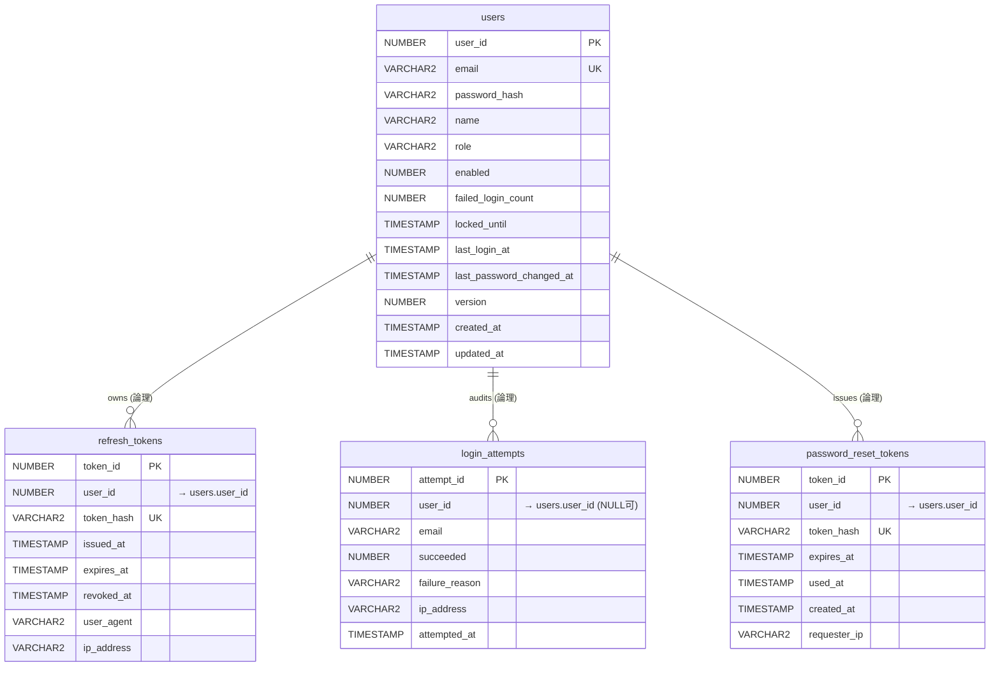

# ログイン機能 DB 設計（Oracle 19c SE2）

## 1. 目的

この文書は、ログイン機能に関する DB 設計の実装基準を定義する。

- 対象 DB: Oracle Database 19c Standard Edition 2
- 対象スキーマ: `template_app`
- 対象範囲: `users` / `refresh_tokens` / `login_attempts` / `password_reset_tokens`
- 運用方針: マイグレーションツールは導入せず、DDL をレビューして手動反映

関連:

- [ADR-0004: データベース戦略](../adr/0004-backend-database-strategy.md)
- [ADR-0005: 認証（JWT + HttpOnly リフレッシュ Cookie）](../adr/0005-auth-jwt-cookie.md)
- [ADR-0023: ログイン機能 DB 設計（小規模向け）](../adr/0023-login-db-schema.md)
- [DDL: backend/src/main/resources/db/oracle/login_schema.sql](../../backend/src/main/resources/db/oracle/login_schema.sql)

## 2. 設計方針

- 小規模プロダクト前提で、正規化は最小限とする
- `users.role` は enum 文字列で保持し、ロールマスタは作らない
- アクセストークンは DB 保存しない
- リフレッシュトークンとパスワードリセットトークンは、平文ではなく SHA-256 ハッシュを保存する
- アカウントロックは `users.failed_login_count` と `users.locked_until` で制御する
- 物理 FK 制約・CHECK 制約は設けない。整合性はアプリケーション層で担保する
- テーブルは `TEMPLATE_TABLE` 表領域、インデックスは `TEMPLATE_INDEX` 表領域に配置する

## 3. テーブルスペース・スキーマ

| 区分 | 表領域 | 初期サイズ | 自動拡張 |
| --- | --- | --- | --- |
| テーブル | `TEMPLATE_TABLE` | 128 MB | 100 MB ずつ、上限なし |
| インデックス | `TEMPLATE_INDEX` | 128 MB | 10 MB ずつ、上限なし |

| スキーマユーザー | デフォルト表領域 | クォータ |
| --- | --- | --- |
| `template_app` | `USERS` | `TEMPLATE_TABLE`・`TEMPLATE_INDEX` 各 16 GB |

テーブルスペース・ユーザー作成は DBA 権限で実施済み（再実行不要）。
DDL ファイルの `[実施済み]` セクションを参照。

## 4. ER 図

> テーブル間の関係は論理的な参照であり、物理 FK 制約は設けていない。



## 5. テーブル定義

### 5.1 users

ユーザーの認証情報とアカウント状態を保持する。

| 列名 | 型 | 必須 | 備考 |
| --- | --- | --- | --- |
| user_id | NUMBER(19) | Y | PK, IDENTITY |
| email | VARCHAR2(255 CHAR) | Y | 一意 |
| password_hash | VARCHAR2(72 CHAR) | Y | BCrypt ハッシュ |
| name | VARCHAR2(100 CHAR) | Y | 表示名 |
| role | VARCHAR2(20 CHAR) | Y | `ROLE_USER` / `ROLE_ADMIN` |
| enabled | NUMBER(1) | Y | 1:有効, 0:無効 |
| failed_login_count | NUMBER(3) | Y | 連続失敗回数 |
| locked_until | TIMESTAMP(6) | N | 一時ロック解除時刻 |
| last_login_at | TIMESTAMP(6) | N | 最終ログイン時刻 |
| last_password_changed_at | TIMESTAMP(6) | Y | パスワード更新時刻 |
| version | NUMBER(19) | Y | 楽観ロック用 |
| created_at | TIMESTAMP(6) | Y | 作成日時 |
| updated_at | TIMESTAMP(6) | Y | 更新日時 |

制約:

- `uk_users_email`

### 5.2 refresh_tokens

リフレッシュトークンをデバイス単位で保持する。平文ではなくハッシュを保存する。

| 列名 | 型 | 必須 | 備考 |
| --- | --- | --- | --- |
| token_id | NUMBER(19) | Y | PK, IDENTITY |
| user_id | NUMBER(19) | Y | → users.user_id（論理参照） |
| token_hash | VARCHAR2(64 CHAR) | Y | SHA-256 hex, 一意 |
| issued_at | TIMESTAMP(6) | Y | 発行時刻 |
| expires_at | TIMESTAMP(6) | Y | 失効時刻 |
| revoked_at | TIMESTAMP(6) | N | 明示失効時刻 |
| user_agent | VARCHAR2(512 CHAR) | N | クライアント情報 |
| ip_address | VARCHAR2(64 CHAR) | N | IP 表現（IPv4/IPv6） |

制約・索引:

- `uk_refresh_tokens_token_hash`
- `idx_refresh_tokens_user_revoked`
- `idx_refresh_tokens_expires_at`

### 5.3 login_attempts

ログイン試行の監査ログ。成功/失敗の両方を記録する。

| 列名 | 型 | 必須 | 備考 |
| --- | --- | --- | --- |
| attempt_id | NUMBER(19) | Y | PK, IDENTITY |
| user_id | NUMBER(19) | N | → users.user_id（論理参照、NULL 可） |
| email | VARCHAR2(255 CHAR) | Y | 入力値 |
| succeeded | NUMBER(1) | Y | 1:成功, 0:失敗 |
| failure_reason | VARCHAR2(30 CHAR) | N | 成功時は NULL |
| ip_address | VARCHAR2(64 CHAR) | N | 送信元 IP |
| attempted_at | TIMESTAMP(6) | Y | 試行時刻 |

制約・索引:

- `idx_login_attempts_email_attempted`
- `idx_login_attempts_attempted_at`

### 5.4 password_reset_tokens

パスワード再設定用のワンタイムトークンを保持する。

| 列名 | 型 | 必須 | 備考 |
| --- | --- | --- | --- |
| token_id | NUMBER(19) | Y | PK, IDENTITY |
| user_id | NUMBER(19) | Y | → users.user_id（論理参照） |
| token_hash | VARCHAR2(64 CHAR) | Y | SHA-256 hex, 一意 |
| expires_at | TIMESTAMP(6) | Y | 失効時刻 |
| used_at | TIMESTAMP(6) | N | 使用時刻 |
| created_at | TIMESTAMP(6) | Y | 作成時刻 |
| requester_ip | VARCHAR2(64 CHAR) | N | リクエスト元 IP |

制約・索引:

- `uk_password_reset_token_hash`
- `idx_password_reset_tokens_user_expires`

## 6. 状態遷移（運用ルール）

### ログイン成功

1. `users.failed_login_count` を 0 に戻す
2. `users.locked_until` を NULL に戻す
3. `users.last_login_at` を更新
4. `refresh_tokens` に新規行 INSERT（`token_hash`, `issued_at`, `expires_at`）
5. `login_attempts` に成功ログ INSERT

### ログイン失敗

1. `users.failed_login_count` を +1
2. しきい値超過で `users.locked_until` を設定
3. `login_attempts` に失敗ログ INSERT（`failure_reason` 設定）

### リフレッシュ

1. 入力されたリフレッシュトークンを SHA-256 化
2. `refresh_tokens.token_hash` を検索し、`revoked_at IS NULL` かつ `expires_at > SYSTIMESTAMP` を確認
3. 旧行の `revoked_at` を設定
4. 新行を INSERT（ローテーション）

### ログアウト

1. 対象セッションの `refresh_tokens.revoked_at` を更新
2. HttpOnly Cookie を削除

## 7. 保守クエリ例

期限切れデータの定期削除（運用ジョブ想定）:

```sql
DELETE FROM template_app.refresh_tokens
 WHERE expires_at < SYSTIMESTAMP - INTERVAL '7' DAY;

DELETE FROM template_app.password_reset_tokens
 WHERE expires_at < SYSTIMESTAMP - INTERVAL '1' DAY;

DELETE FROM template_app.login_attempts
 WHERE attempted_at < SYSTIMESTAMP - INTERVAL '90' DAY;
```

## 8. エンティティ変更方針（対応表）

以下は実装時の対応方針。今回タスクではコード変更は行わない。

### 8.1 User.java

| 現状 | 変更方針 |
| --- | --- |
| `id` | `userId`（DB 列名 `user_id`）へ名称統一 |
| `password` | `passwordHash`（DB 列名 `password_hash`）へ変更 |
| `refreshToken` | 削除（`refresh_tokens` へ移行） |
| `role` | 維持（`@Enumerated(EnumType.STRING)`） |
| なし | `failedLoginCount` 追加 |
| なし | `lockedUntil` 追加 |
| なし | `lastLoginAt` 追加 |
| なし | `lastPasswordChangedAt` 追加 |
| なし | `@Version version` 追加 |

### 8.2 新規エンティティ

| エンティティ | 主なフィールド | 関連 |
| --- | --- | --- |
| `RefreshToken` | `tokenId`, `tokenHash`, `issuedAt`, `expiresAt`, `revokedAt`, `userAgent`, `ipAddress` | `@ManyToOne User` |
| `LoginAttempt` | `attemptId`, `email`, `succeeded`, `failureReason`（**`String`**。DB の CHECK 制約は設けないため Java enum は使わず、アプリ層で値を検証）, `ipAddress`, `attemptedAt` | `@ManyToOne User(nullable = true)` |
| `PasswordResetToken` | `tokenId`, `tokenHash`, `expiresAt`, `usedAt`, `createdAt`, `requesterIp` | `@ManyToOne User` |
