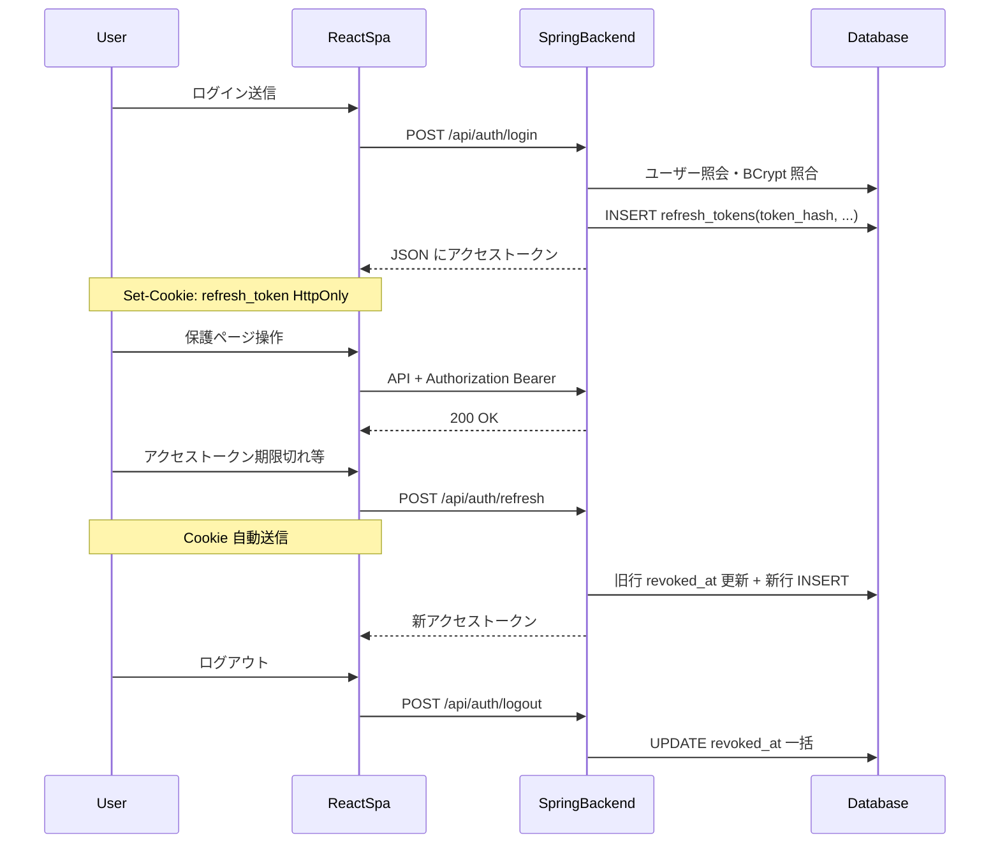
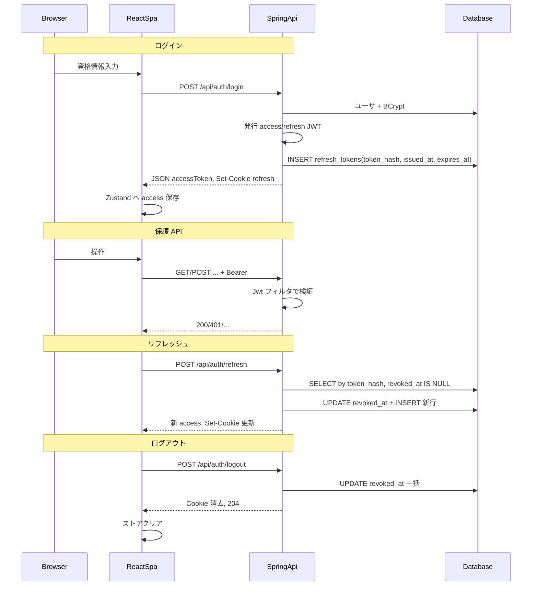

# ログイン処理と JWT ライフサイクル ガイド

この文書は、Product Template における**ログインから API 呼び出し、トークン更新、ログアウト**までの流れを説明する。セキュリティの基礎が少ない読者向けに、用語の初出では短い補足を入れる。

- **主な技術**: Spring Security + JJWT（バックエンド）、HttpOnly Cookie でのリフレッシュ、React + Axios（フロント）
- **設計の要約**: [ADR-0005: 認証（JWT + HttpOnly リフレッシュ Cookie）](../adr/0005-auth-jwt-cookie.md)
- **DB スキーマ**: [ログイン機能 DB 定義書](../db/login-schema.md)、DDL は [login_schema.sql](../../backend/src/main/resources/db/oracle/login_schema.sql)

**本ガイドのスコープ外**: `login_attempts` テーブルへの監査 INSERT、`password_reset_tokens` のフローは [login-schema.md](../db/login-schema.md) を参照（実装は今後の拡張に委ねる）。

---

## 1. 全体像（30 秒版）

- **ブラウザ**: 画面操作、**HttpOnly** のリフレッシュ用 Cookie、HTTP 送受信
- **フロント (SPA)**: ログイン画面、`Authorization: Bearer` に載せるアクセストークン（Zustand）、Axios インターセプター
- **バックエンド (Spring)**: メール/パスワード検証、JWT 発行、保護 API での JWT 検証、リフレッシュ/ログアウト
- **DB (Oracle)**: `users`（パスワードは BCrypt ハッシュ）、**`refresh_tokens`（リフレッシュ JWT の SHA-256 ハッシュのみ保存。平文は保存しない）**



---

## 2. DB におけるリフレッシュトークン

- **アクセストークン**は DB に保存しない（短命 JWT のみ）。
- **リフレッシュトークン**は JWT 文字列そのものではなく、**SHA-256（hex 64 文字）の `token_hash`** を `template_app.refresh_tokens` に保存する（盗難時のリスク低減）。
- 同一ユーザーで複数デバイスを許容するため、**ユーザーごとに複数行**があり得る。ログアウト時は該当ユーザーの未失効行を一括で `revoked_at` 更新する。

---

## 3. ログイン `POST /api/auth/login`

### 3-1. フロント

`useLogin` が `/api/auth/login` に POST し、成功時はアクセストークンをストアに保存し `/api/users/me` でユーザー情報を取得する。

```21:39:frontend/src/hooks/useAuth.ts
export function useLogin() {
  const navigate = useNavigate()
  const { setAccessToken, setUser } = useAuthStore()
  const { toast } = useToast()

  return useMutation({
    mutationFn: async (data: LoginRequest): Promise<TokenResponse> => {
      const response = await apiClient.post<TokenResponse>('/api/auth/login', data)
      return response.data
    },
    onSuccess: async (data) => {
      setAccessToken(data.accessToken!)

      try {
        const userResponse = await apiClient.get<UserResponse>('/api/users/me', {
          headers: {
            Authorization: `Bearer ${data.accessToken}`,
          },
        })
```

`apiClient` は `withCredentials: true` のため、レスポンスの `Set-Cookie`（リフレッシュ）がブラウザに保存される。

```13:19:frontend/src/lib/axios.ts
export const apiClient = axios.create({
  baseURL: API_BASE_URL,
  headers: {
    'Content-Type': 'application/json',
  },
  withCredentials: true,
})
```

### 3-2. コントローラ: Cookie 付与と JSON からのマスク

リフレッシュは HttpOnly Cookie に載せ、**JSON の `refreshToken` は `null` に置き換え**て返す。

```42:55:backend/src/main/java/com/product/template/controller/AuthController.java
    @PostMapping("/login")
    public ResponseEntity<TokenResponse> login(
            @Valid @RequestBody LoginRequest request,
            HttpServletResponse response
    ) {
        TokenResponse tokenResponse = authService.login(request);
        CookieUtil.addRefreshTokenCookie(
                response,
                tokenResponse.getRefreshToken(),
                jwtConfig.getRefreshTokenExpiration(),
                jwtConfig.isCookieSecure()
        );
        tokenResponse.setRefreshToken(null);
        return ResponseEntity.ok(tokenResponse);
    }
```

### 3-3. サービス: 認証 + JWT 発行 + `refresh_tokens` へ INSERT

1. `AuthenticationManager` でメール・パスワードを検証  
2. アクセス用・リフレッシュ用の **JWT をそれぞれ生成**  
3. `saveRefreshTokenRecord` で **SHA-256 ハッシュ**を計算し `RefreshToken` エンティティを保存

```54:75:backend/src/main/java/com/product/template/service/AuthService.java
    @Transactional
    public TokenResponse login(LoginRequest request) {
        Authentication authentication = authenticationManager.authenticate(
            new UsernamePasswordAuthenticationToken(
                request.getEmail(),
                request.getPassword()
            )
        );

        String accessToken = jwtTokenProvider.generateAccessToken(authentication);
        String refreshToken = jwtTokenProvider.generateRefreshToken(request.getEmail());

        User user = userRepository.findByEmail(request.getEmail())
            .orElseThrow(() -> new RuntimeException("User not found"));

        saveRefreshTokenRecord(user, refreshToken);

        return new TokenResponse()
            .accessToken(accessToken)
            .refreshToken(refreshToken)
            .tokenType("Bearer")
            .expiresIn(jwtConfig.getAccessTokenExpiration() / 1000);
    }
```

```166:177:backend/src/main/java/com/product/template/service/AuthService.java
    private void saveRefreshTokenRecord(User user, String rawRefreshToken) {
        String hash = TokenHashUtil.sha256Hex(rawRefreshToken);
        long refreshMs = jwtConfig.getRefreshTokenExpiration();
        LocalDateTime now = LocalDateTime.now().truncatedTo(ChronoUnit.MICROS);
        LocalDateTime exp = now.plus(refreshMs, ChronoUnit.MILLIS);
        refreshTokenRepository.save(RefreshToken.builder()
            .user(user)
            .tokenHash(hash)
            .issuedAt(now)
            .expiresAt(exp)
            .build());
    }
```

### 3-4. HttpOnly Cookie の属性

```34:47:backend/src/main/java/com/product/template/security/CookieUtil.java
    public static void addRefreshTokenCookie(
            HttpServletResponse response,
            String refreshToken,
            long expirationMs,
            boolean secure
    ) {
        ResponseCookie cookie = ResponseCookie.from(REFRESH_TOKEN_COOKIE, refreshToken)
                .httpOnly(true)
                .secure(secure)
                .sameSite("Lax")
                .path(COOKIE_PATH)
                .maxAge(Duration.ofMillis(expirationMs))
                .build();
        response.addHeader(HttpHeaders.SET_COOKIE, cookie.toString());
    }
```

- **path**: `/api/auth` のみ（認証系への Cookie 送信に限定）  
- **SameSite=Lax**、本番では **Secure**（HTTPS）を推奨（`jwt.cookie-secure`）

### 3-5. フロント: アクセストークンの扱い

Zustand の `persist` で **`user` と `isAuthenticated` のみ**ローカルストレージに残し、アクセストークン自体は永続化しない。

```85:91:frontend/src/store/useAuthStore.ts
    {
      name: 'auth-storage',
      storage: createJSONStorage(() => localStorage),
      partialize: (state) => ({
        user: state.user,
        isAuthenticated: state.isAuthenticated,
      }),
    }
```

---

## 4. JWT の要点（このテンプレートの実装）

- **subject (`sub`)**: メールアドレス  
- **署名**: HS256（設定の `jwt.secret` / 環境変数 `JWT_SECRET`）  
- **アクセスとリフレッシュの違い**: 主に**有効期限**（`JwtConfig` のミリ秒設定）

```82:92:backend/src/main/java/com/product/template/security/JwtTokenProvider.java
    private String buildToken(String username, long expiration, Map<String, Object> extraClaims) {
        Date now = new Date();
        Date expiryDate = new Date(now.getTime() + expiration);

        return Jwts.builder()
            .claims(extraClaims)
            .subject(username)
            .issuedAt(now)
            .expiration(expiryDate)
            .signWith(secretKey)
            .compact();
    }
```

---

## 5. 保護 API（Bearer JWT）

### 5-1. リクエストに `Authorization: Bearer` を付与

```21:28:frontend/src/lib/axios.ts
apiClient.interceptors.request.use(
  (config: InternalAxiosRequestConfig) => {
    const token = useAuthStore.getState().accessToken
    if (token) {
      config.headers.Authorization = `Bearer ${token}`
    }
    return config
  },
```

### 5-2. バックエンド: JWT フィルタとセッション方針

```47:77:backend/src/main/java/com/product/template/security/JwtAuthenticationFilter.java
    protected void doFilterInternal(
        @NonNull HttpServletRequest request,
        @NonNull HttpServletResponse response,
        @NonNull FilterChain filterChain
    ) throws ServletException, IOException {
        try {
            String jwt = extractJwtFromRequest(request);

            if (StringUtils.hasText(jwt) && jwtTokenProvider.validateToken(jwt)) {
                String username = jwtTokenProvider.extractUsername(jwt);
                UserDetails userDetails = userDetailsService.loadUserByUsername(username);

                if (jwtTokenProvider.isTokenValid(jwt, userDetails)) {
                    UsernamePasswordAuthenticationToken authentication =
                        new UsernamePasswordAuthenticationToken(
                            userDetails,
                            null,
                            userDetails.getAuthorities()
                        );
                    authentication.setDetails(
                        new WebAuthenticationDetailsSource().buildDetails(request)
                    );
                    SecurityContextHolder.getContext().setAuthentication(authentication);
                }
            }
        } catch (Exception ex) {
            log.error("Could not set user authentication in security context", ex);
        }

        filterChain.doFilter(request, response);
    }
```

```70:76:backend/src/main/java/com/product/template/config/SecurityConfig.java
            .sessionManagement(session -> session
                .sessionCreationPolicy(SessionCreationPolicy.STATELESS)
            )
            .authorizeHttpRequests(auth -> auth
                .requestMatchers(PUBLIC_ENDPOINTS).permitAll()
                .anyRequest().authenticated()
            )
```

---

## 6. トークンリフレッシュ `POST /api/auth/refresh`

### 6-1. フロント: 401 時のリフレッシュ（単一実行 + キュー）

`apiClient` のレスポンスインターセプタが 401 を捕捉し、`/api/auth/refresh` を **Cookie 同送**で POST する。多重実行は `isRefreshing` で抑止。

```92:105:frontend/src/lib/axios.ts
      try {
        const response = await axios.post(
          `${API_BASE_URL}/api/auth/refresh`,
          {},
          { withCredentials: true }
        )

        const { accessToken } = response.data
        useAuthStore.getState().setAccessToken(accessToken)

        processQueue(null, accessToken)

        originalRequest.headers.Authorization = `Bearer ${accessToken}`
        return apiClient(originalRequest)
```

### 6-2. コントローラ: Cookie から取得してサービスへ

```79:93:backend/src/main/java/com/product/template/controller/AuthController.java
    @PostMapping("/refresh")
    public ResponseEntity<TokenResponse> refreshToken(
            HttpServletRequest request,
            HttpServletResponse response
    ) {
        String refreshToken = CookieUtil.extractRefreshToken(request);
        TokenResponse tokenResponse = authService.refreshToken(refreshToken);
        CookieUtil.addRefreshTokenCookie(
                response,
                tokenResponse.getRefreshToken(),
                jwtConfig.getRefreshTokenExpiration(),
                jwtConfig.isCookieSecure()
        );
        tokenResponse.setRefreshToken(null);
        return ResponseEntity.ok(tokenResponse);
    }
```

### 6-3. サービス: JWT 検証 → ハッシュ照会 → ローテーション

1. Cookie の JWT を `validateToken`  
2. `TokenHashUtil.sha256Hex(refreshToken)` で **`refresh_tokens` を検索**（`revoked_at IS NULL` の行）  
3. 期限・`sub` とメールの一致を確認  
4. **旧行に `revoked_at` を設定**して保存  
5. 新アクセス・新リフレッシュ JWT を発行し、**新行を INSERT**（再びハッシュのみ DB に保存）

```114:150:backend/src/main/java/com/product/template/service/AuthService.java
    @Transactional
    public TokenResponse refreshToken(String refreshToken) {
        if (refreshToken == null || refreshToken.isBlank()) {
            throw new InvalidTokenException("リフレッシュトークンが提供されていません");
        }

        if (!jwtTokenProvider.validateToken(refreshToken)) {
            throw new InvalidTokenException("無効なリフレッシュトークンです");
        }

        String tokenHash = TokenHashUtil.sha256Hex(refreshToken);
        RefreshToken current = refreshTokenRepository.findByTokenHashAndRevokedAtIsNull(tokenHash)
            .orElseThrow(() -> new InvalidTokenException("リフレッシュトークンが見つかりません"));

        if (current.getExpiresAt().isBefore(LocalDateTime.now())) {
            throw new InvalidTokenException("リフレッシュトークンの有効期限が切れています");
        }

        User user = current.getUser();
        String username = jwtTokenProvider.extractUsername(refreshToken);
        if (!username.equals(user.getEmail())) {
            throw new InvalidTokenException("トークンが一致しません");
        }

        current.setRevokedAt(LocalDateTime.now().truncatedTo(ChronoUnit.MICROS));
        refreshTokenRepository.save(current);

        String newAccessToken = jwtTokenProvider.generateAccessToken(user.getEmail());
        String newRefreshToken = jwtTokenProvider.generateRefreshToken(user.getEmail());

        saveRefreshTokenRecord(user, newRefreshToken);

        return new TokenResponse()
            .accessToken(newAccessToken)
            .refreshToken(newRefreshToken)
            .tokenType("Bearer")
            .expiresIn(jwtConfig.getAccessTokenExpiration() / 1000);
    }
```

永続化のクエリは [RefreshTokenRepository.java](../../backend/src/main/java/com/product/template/repository/RefreshTokenRepository.java) を参照。

---

## 7. ログアウト `POST /api/auth/logout`

### 7-1. コントローラ

認証済みユーザーのメールでサービスを呼び、Cookie を削除する。

```103:110:backend/src/main/java/com/product/template/controller/AuthController.java
    @PostMapping("/logout")
    public ResponseEntity<Void> logout(
            @AuthenticationPrincipal UserDetails userDetails,
            HttpServletResponse response
    ) {
        authService.logout(userDetails.getUsername());
        CookieUtil.clearRefreshTokenCookie(response, jwtConfig.isCookieSecure());
        return ResponseEntity.noContent().build();
    }
```

### 7-2. サービス: 該当ユーザーの未失効リフレッシュを一括失効

```158:164:backend/src/main/java/com/product/template/service/AuthService.java
    @Transactional
    public void logout(String email) {
        userRepository.findByEmail(email).ifPresent(user ->
            refreshTokenRepository.revokeAllByUser(user, LocalDateTime.now().truncatedTo(ChronoUnit.MICROS))
        );
        log.info("User logged out: {}", email);
    }
```

### 7-3. Cookie の削除

```56:64:backend/src/main/java/com/product/template/security/CookieUtil.java
    public static void clearRefreshTokenCookie(HttpServletResponse response, boolean secure) {
        ResponseCookie cookie = ResponseCookie.from(REFRESH_TOKEN_COOKIE, "")
                .httpOnly(true)
                .secure(secure)
                .sameSite("Lax")
                .path(COOKIE_PATH)
                .maxAge(0)
                .build();
        response.addHeader(HttpHeaders.SET_COOKIE, cookie.toString());
    }
```

### 7-4. フロント

アクセストークンがある場合のみログアウト API を呼び、ストアをクリアする。

```111:121:frontend/src/hooks/useAuth.ts
export function useLogout() {
  const navigate = useNavigate()
  const { logout, accessToken } = useAuthStore()
  const { toast } = useToast()

  return useMutation({
    mutationFn: async () => {
      if (accessToken) {
        await apiClient.post('/api/auth/logout')
      }
    },
```

> **補足**: JWT はサーバ側の denylist を持たないため、**ログアウト後も期限内の古いアクセストークン**が悪用されうる一般的なトレードオフがある。軽減のため**短命**のアクセストークンとする。

---

## 8. セキュリティ早見表

| 論点 | 本プロダクトの扱い |
| --- | --- |
| パスワード (DB) | 平文保存しない（BCrypt） |
| リフレッシュ (DB) | **SHA-256 ハッシュのみ**（平文 JWT は DB に保存しない） |
| リフレッシュ (ブラウザ) | HttpOnly Cookie（path `/api/auth`） |
| トークン改ざん | JWS 署名（`JWT_SECRET` の厳重管理） |
| XSS | リフレッシュは HttpOnly。アクセストークンは JS から参照されるため **XSS 対策は必須** |
| CSRF | ステートレスで CSRF トークン無し。**SameSite**・**CORS**・**最小 Cookie path**・本番 **HTTPS + Secure** |

---

## 9. まとめシーケンス図



---

## 10. 参考

| 文書・ファイル |
| --- |
| [ADR-0005: 認証（JWT + HttpOnly リフレッシュ Cookie）](../adr/0005-auth-jwt-cookie.md) |
| [ADR-0023: ログイン機能 DB 設計（小規模向け）](../adr/0023-login-db-schema.md) |
| [ログイン機能 DB 定義書](../db/login-schema.md) |
| [login_schema.sql](../../backend/src/main/resources/db/oracle/login_schema.sql) |
| [AuthController.java](../../backend/src/main/java/com/product/template/controller/AuthController.java) |
| [AuthService.java](../../backend/src/main/java/com/product/template/service/AuthService.java) |
| [RefreshTokenRepository.java](../../backend/src/main/java/com/product/template/repository/RefreshTokenRepository.java) |
| [JwtTokenProvider.java](../../backend/src/main/java/com/product/template/security/JwtTokenProvider.java) |
| [JwtAuthenticationFilter.java](../../backend/src/main/java/com/product/template/security/JwtAuthenticationFilter.java) |
| [CookieUtil.java](../../backend/src/main/java/com/product/template/security/CookieUtil.java) |
| [SecurityConfig.java](../../backend/src/main/java/com/product/template/config/SecurityConfig.java) |
| [application.yml](../../backend/src/main/resources/application.yml) |
| [useAuth.ts](../../frontend/src/hooks/useAuth.ts) |
| [axios.ts](../../frontend/src/lib/axios.ts) |
| [useAuthStore.ts](../../frontend/src/store/useAuthStore.ts) |
