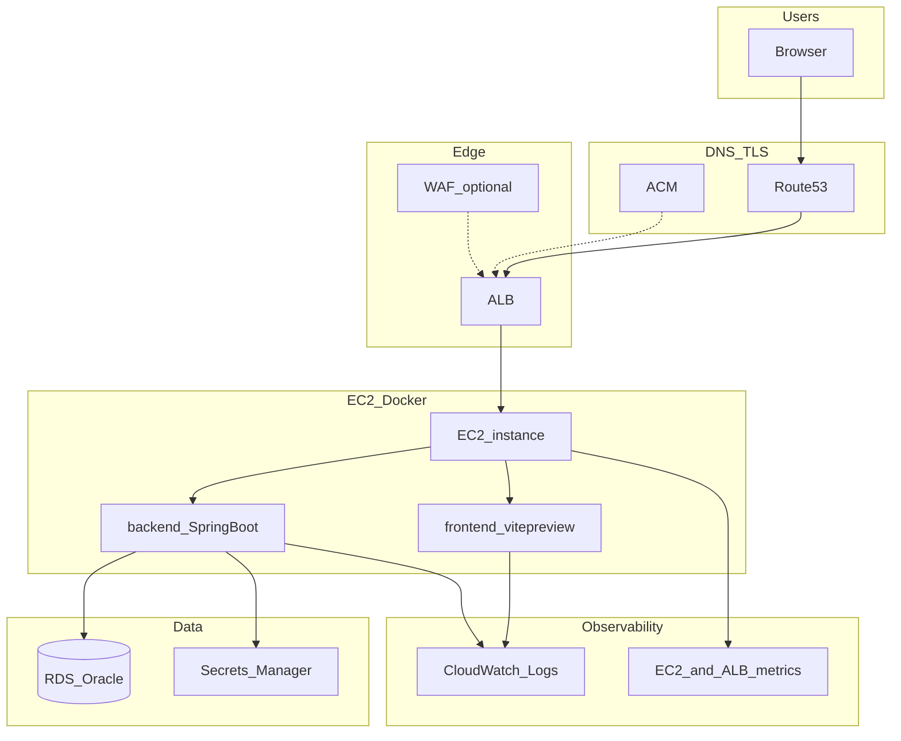

# AWS インフラ整備のベストプラクティス（本プロダクトのリリース前提）

本テンプレートを **単一 EC2 + Docker（docker compose）** で本番運用する際に推奨する AWS 上の整備項目とチェックリストです。詳細な意思決定は [docs/adr/](../adr/README.md) を参照してください。

---

## アーキテクチャ概要

---

## 1. アカウントとガバナンス

- **AWS Organizations** でアカウント分離（本番 / 非本番）。
- **SCP** で危険操作（全リージョンの公開 S3 等）を制限。
- **IAM**: 人間は **短期クレデンシャル + MFA**。アプリは **EC2 インスタンスプロファイル（IAM ロール）**。
- **タグ付け**: `Environment`, `Product`, `Owner`, `CostCenter` を必須化。

---

## 2. ネットワーク

- **VPC**: マルチ AZ。パブリック（ALB）+ プライベート（アプリ EC2 / RDS）。
- **VPC Flow Logs**: セキュリティ調査用に有効化（コストと相談）。
- **ALB**: HTTPS のみ公開推奨。HTTP は 443 へリダイレクト。
- **WAF**: 一般的な攻撃・レート制限。公開 API には特に有効。

関連 ADR: [ADR-0018](../adr/0018-aws-network-topology.md)

---

## 3. コンピュート（EC2 + Docker）

- **最小権限インスタンスプロファイル**: Secrets、RDS、SES、ECR pull、必要な S3 のみ。
- **デプロイ**: 手動 SSH で `docker compose pull && up -d`（自動化する場合は別途 Runbook）。
- **リソース**: インスタンスタイプは負荷に合わせて選定し、CloudWatch で CPU/メモリを監視。

関連 ADR: [ADR-0025](../adr/0025-aws-runtime-ec2-docker.md)

---

## 4. データとバックアップ

- **RDS**: Multi-AZ、暗号化（KMS）、自動バックアップ、メンテナンスウィンドウ。
- **リストア手順**を Runbook に記載。
- **S3** を使う場合: バケットポリシー・SSE・パブリックブロック全有効。

関連 ADR: [ADR-0019](../adr/0019-aws-data-layer.md)

---

## 5. シークレット

- **Secrets Manager** を正とし、平文 `.env` on サーバーを廃止。
- ローテーション対象（DB パスワード等）は自動または定期手順を定義。

関連: [aws-secrets-manager-setup.md](../aws-secrets-manager-setup.md)、[ADR-0020](../adr/0020-aws-secrets-management.md)

---

## 6. 可観測性

- **CloudWatch Logs**: Docker awslogs ドライバ等で集約。保持期間、サブスクリプションフィルターでエラー通知。
- **メトリクス**: EC2・ALB・RDS の標準メトリクス。
- **アラーム**: ALB 5xx、ターゲット不健全、RDS 空き容量、EC2 StatusCheckFailed 等。

関連 ADR: [ADR-0021](../adr/0021-aws-observability.md)

---

## 7. CI/CD（IaC は見送り）

- **ECR**: イメージスキャン（Enhanced scanning 任意）。詳細は [Amazon ECR 構築・運用ガイド](../aws-ecr-setup.md) を参照。
- **GitHub Actions + OIDC**: 長期アクセスキーを避けてイメージを push。
- **インフラ**: VPC・ALB・EC2 等は **コンソールまたは組織手順**で構築（本テンプレートでは **Terraform 等の IaC は導入見送り**）。

関連 ADR: [ADR-0026](../adr/0026-cicd-without-iac.md)

---

## 8. コスト最適化

- 開発環境: **夜間停止**（EC2 のスケジュール停止）などを検討。
- **Savings Plans / Reserved** はベースライン負荷が見えてから。
- **ログの過剰出力**を抑える（本番 DEBUG 禁止）。

---

## 9. セキュリティハブ（推奨サービス）

- **Security Hub** + **GuardDuty** + **Config** でベースライン監査。
- 依存ライブラリの **Dependabot / SCA** を CI に組み込む（アプリ層）。

---

## 10. 新規プロダクト立ち上げチェックリスト（要約）

| # | 項目 | 状態 |
|---|------|------|
| 1 | ポート台帳更新（[スプレッドシート](https://docs.google.com/spreadsheets/d/1pMseDeBjZCV_ppZLVuaaD78iooxR7yeXWP5jsxzJcS8/edit?gid=0#gid=0)／[port-registry.md](../port-registry.md)） | |
| 2 | Secrets Manager 登録・EC2 起動スクリプトで参照 | |
| 3 | VPC / SG 設計レビュー | |
| 4 | ALB + ACM + Route 53 | |
| 5 | EC2 + docker compose 起動 + ALB ヘルス確認 | |
| 6 | CloudWatch アラーム | |
| 7 | RDS バックアップ・リストア試験 | |
| 8 | CI（ECR push）+ SSH 手動デプロイ | |
| 9 | 本番 `APP_FRONTEND_BASE_URL` / CORS 本番ドメイン | |
| 10 | インシデント Runbook（連絡先・ロールバック） | |

---

## 関連ドキュメント

- [ec2-new-product-release.md](ec2-new-product-release.md)
- [Amazon ECR 構築・運用ガイド](../aws-ecr-setup.md)
- [AWS RDS Oracle 設定](../aws-rds-oracle-setup.md)
- [AWS SES 設定](../aws-ses-setup.md)
